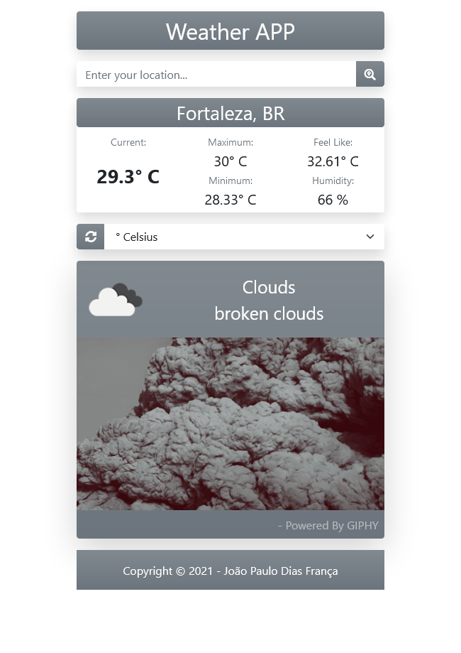

# Weather APP

> A small app that shows weather information for your location.

The APP has a form field where the user can input their location and click on the button to search for weather information about the chosen location.
The user can chose the units for temperature.
The APP displays a GIF animation based on the current weather information;
The APP is responsive.

## Built With

- Major languages: HTML, CSS, and Javascript
- Frameworks: Bootstrap
- Technologies: Webpacker

## Live Demo

[Weather APP](https://livedemo.com)

## Getting Started*

To get a local copy up and running follow these simple example steps.

### Setup

 - On the top of this repo click on the button named "Clone"
 - Copy the HTTP URL or SSH.
 - On the terminal type `git clone <copied-value>` where is the value you copied on the previous step.

 or

 - On the top of this repo click on the button named "Clone"
 - Click on the button "Download zip".

### Usage

- Open the `index.html` file inside the `dist` folder using your browser of choice.

## Authors

👤 **João Paulo Dias França**

- GitHub: [@jpdf00](https://github.com/jpdf00)
- Twitter: [@jpdf00](https://twitter.com/jpdf00)
- LinkedIn: [João Paulo Dias França](https://www.linkedin.com/in/jpdf00/)

## 🤝 Contributing

Contributions, issues, and feature requests are welcome!

Feel free to check the [issues page](https://github.com/jpdf00/weather-app/issues).

## Show your support

Give a ⭐️ if you like this project!

## Acknowledgments

- Weather information fetched from [OpenWeather](https://openweathermap.org/).
- Animation fetched from [GIPHY](https://developers.giphy.com/).
- Thanks to [@AdfPizarro](https://github.com/AdfPizarro) and to [@luisvinicius09](https://github.com/luisvinicius09) for support and inspiration.

## 📝 License

This project is [MIT](./LICENSE) licensed.
